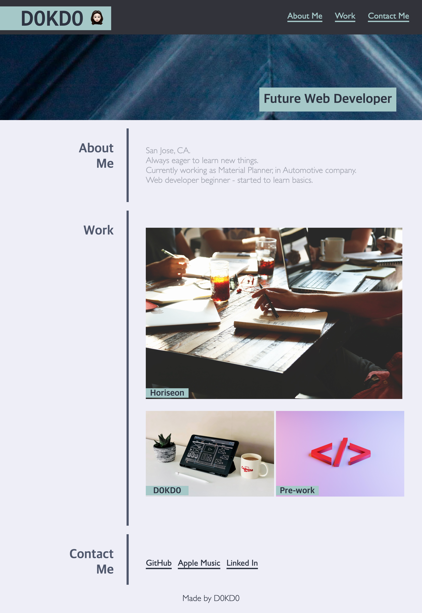

# Module 2 Challenge : Lernantino/D0KD0

## Description
This is a second project to build a portfolio for myself. Example page image was given without code - which made me to start from a scratch.  
My portfolio page is looking like the example design but I replaced the contents with my personal information.  
Images used in this page are all from a free-soured website.

## Screenshot

## Lesson learned
During working on the assignment, I learned following things -
* Being able to build html and css code from the scratch
* How to divide sections and give borders between them
* How to have two nav and assign different style
* How to link images to external pages

## Deployed application link
